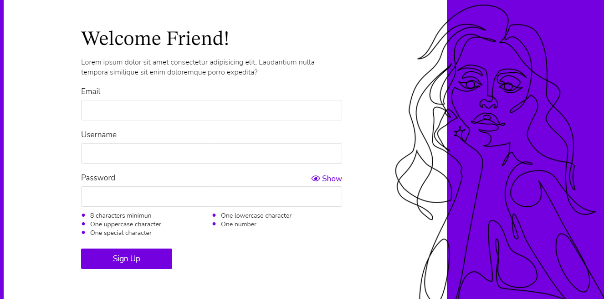
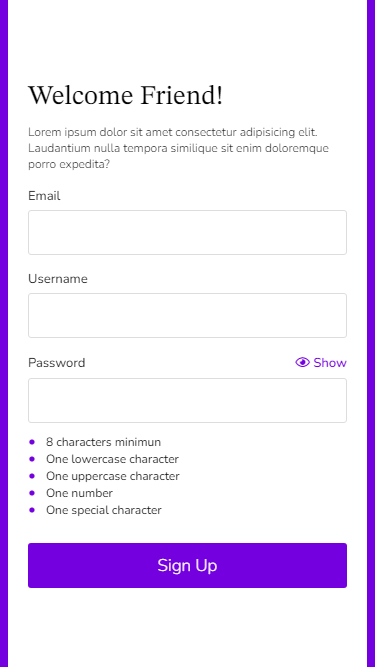

# Sign Up Form

Sign Up page using HTML, CSS, SASS and Javascript.

### Web Version

### Mobile Version

## 🚀 Starting

To start the project, just open the file `index.html` in your preferred browser.  
Or you can just access <a href="https://guilherme-arruda.github.io/Sign-Up-Form/" target="_ blank">clicking here<a/>.

## 📄 License
This project is under MIT license - see the file [LICENSE.md](https://github.com/Guilherme-Arruda/Sign-Up-Form/blob/master/LICENSE) for details.

---
##### Coded with love by Guilherme Arruda ♥️
